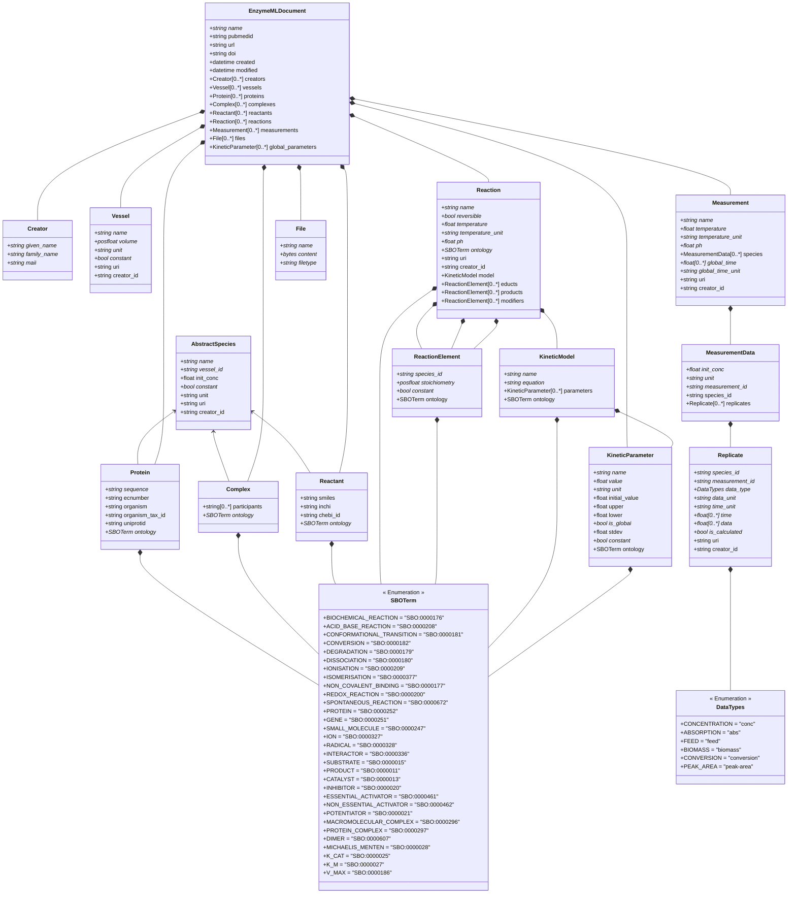

```mermaid
classDiagram
    AbstractSpecies <-- Protein
    AbstractSpecies <-- Complex
    AbstractSpecies <-- Reactant
    EnzymeMLDocument *-- Creator
    EnzymeMLDocument *-- Vessel
    EnzymeMLDocument *-- Protein
    EnzymeMLDocument *-- Complex
    EnzymeMLDocument *-- Reactant
    EnzymeMLDocument *-- Reaction
    EnzymeMLDocument *-- Measurement
    EnzymeMLDocument *-- File
    EnzymeMLDocument *-- KineticParameter
    Protein *-- SBOTerm
    Complex *-- SBOTerm
    Reactant *-- SBOTerm
    Reaction *-- SBOTerm
    Reaction *-- KineticModel
    Reaction *-- ReactionElement
    Reaction *-- ReactionElement
    Reaction *-- ReactionElement
    ReactionElement *-- SBOTerm
    KineticModel *-- KineticParameter
    KineticModel *-- SBOTerm
    KineticParameter *-- SBOTerm
    Measurement *-- MeasurementData
    MeasurementData *-- Replicate
    Replicate *-- DataTypes
    
    class EnzymeMLDocument {
        +string name*
        +string pubmedid
        +string url
        +string doi
        +datetime created
        +datetime modified
        +Creator[0..*] creators
        +Vessel[0..*] vessels
        +Protein[0..*] proteins
        +Complex[0..*] complexes
        +Reactant[0..*] reactants
        +Reaction[0..*] reactions
        +Measurement[0..*] measurements
        +File[0..*] files
        +KineticParameter[0..*] global_parameters
    }
    
    class Creator {
        +string given_name*
        +string family_name*
        +string mail*
    }
    
    class Vessel {
        +string name*
        +posfloat volume*
        +string unit*
        +bool constant*
        +string uri
        +string creator_id
    }
    
    class AbstractSpecies {
        +string name*
        +string vessel_id*
        +float init_conc
        +bool constant*
        +string unit
        +string uri
        +string creator_id
    }
    
    class Protein {
        +string sequence*
        +string ecnumber
        +string organism
        +string organism_tax_id
        +string uniprotid
        +SBOTerm ontology*
    }
    
    class Complex {
        +string[0..*] participants
        +SBOTerm ontology*
    }
    
    class Reactant {
        +string smiles
        +string inchi
        +string chebi_id
        +SBOTerm ontology*
    }
    
    class Reaction {
        +string name*
        +bool reversible*
        +float temperature*
        +string temperature_unit*
        +float ph*
        +SBOTerm ontology*
        +string uri
        +string creator_id
        +KineticModel model
        +ReactionElement[0..*] educts
        +ReactionElement[0..*] products
        +ReactionElement[0..*] modifiers
    }
    
    class ReactionElement {
        +string species_id*
        +posfloat stoichiometry*
        +bool constant*
        +SBOTerm ontology
    }
    
    class KineticModel {
        +string name*
        +string equation*
        +KineticParameter[0..*] parameters
        +SBOTerm ontology
    }
    
    class KineticParameter {
        +string name*
        +float value*
        +string unit*
        +float initial_value
        +float upper
        +float lower
        +bool is_global*
        +float stdev
        +bool constant*
        +SBOTerm ontology
    }
    
    class Measurement {
        +string name*
        +float temperature*
        +string temperature_unit*
        +float ph*
        +MeasurementData[0..*] species
        +float[0..*] global_time*
        +string global_time_unit*
        +string uri
        +string creator_id
    }
    
    class MeasurementData {
        +float init_conc*
        +string unit*
        +string measurement_id*
        +string species_id
        +Replicate[0..*] replicates
    }
    
    class Replicate {
        +string species_id*
        +string measurement_id*
        +DataTypes data_type*
        +string data_unit*
        +string time_unit*
        +float[0..*] time*
        +float[0..*] data*
        +bool is_calculated*
        +string uri
        +string creator_id
    }
    
    class File {
        +string name*
        +bytes content*
        +string filetype*
    }
    
    class SBOTerm {
        << Enumeration >>
        +BIOCHEMICAL_REACTION = "SBO:0000176"
        +ACID_BASE_REACTION = "SBO:0000208"
        +CONFORMATIONAL_TRANSITION = "SBO:0000181"
        +CONVERSION = "SBO:0000182"
        +DEGRADATION = "SBO:0000179"
        +DISSOCIATION = "SBO:0000180"
        +IONISATION = "SBO:0000209"
        +ISOMERISATION = "SBO:0000377"
        +NON_COVALENT_BINDING = "SBO:0000177"
        +REDOX_REACTION = "SBO:0000200"
        +SPONTANEOUS_REACTION = "SBO:0000672"
        +PROTEIN = "SBO:0000252"
        +GENE = "SBO:0000251"
        +SMALL_MOLECULE = "SBO:0000247"
        +ION = "SBO:0000327"
        +RADICAL = "SBO:0000328"
        +INTERACTOR = "SBO:0000336"
        +SUBSTRATE = "SBO:0000015"
        +PRODUCT = "SBO:0000011"
        +CATALYST = "SBO:0000013"
        +INHIBITOR = "SBO:0000020"
        +ESSENTIAL_ACTIVATOR = "SBO:0000461"
        +NON_ESSENTIAL_ACTIVATOR = "SBO:0000462"
        +POTENTIATOR = "SBO:0000021"
        +MACROMOLECULAR_COMPLEX = "SBO:0000296"
        +PROTEIN_COMPLEX = "SBO:0000297"
        +DIMER = "SBO:0000607"
        +MICHAELIS_MENTEN = "SBO:0000028"
        +K_CAT = "SBO:0000025"
        +K_M = "SBO:0000027"
        +V_MAX = "SBO:0000186"
    }
    
    class DataTypes {
        << Enumeration >>
        +CONCENTRATION = "conc"
        +ABSORPTION = "abs"
        +FEED = "feed"
        +BIOMASS = "biomass"
        +CONVERSION = "conversion"
        +PEAK_AREA = "peak-area"
    }
    
```