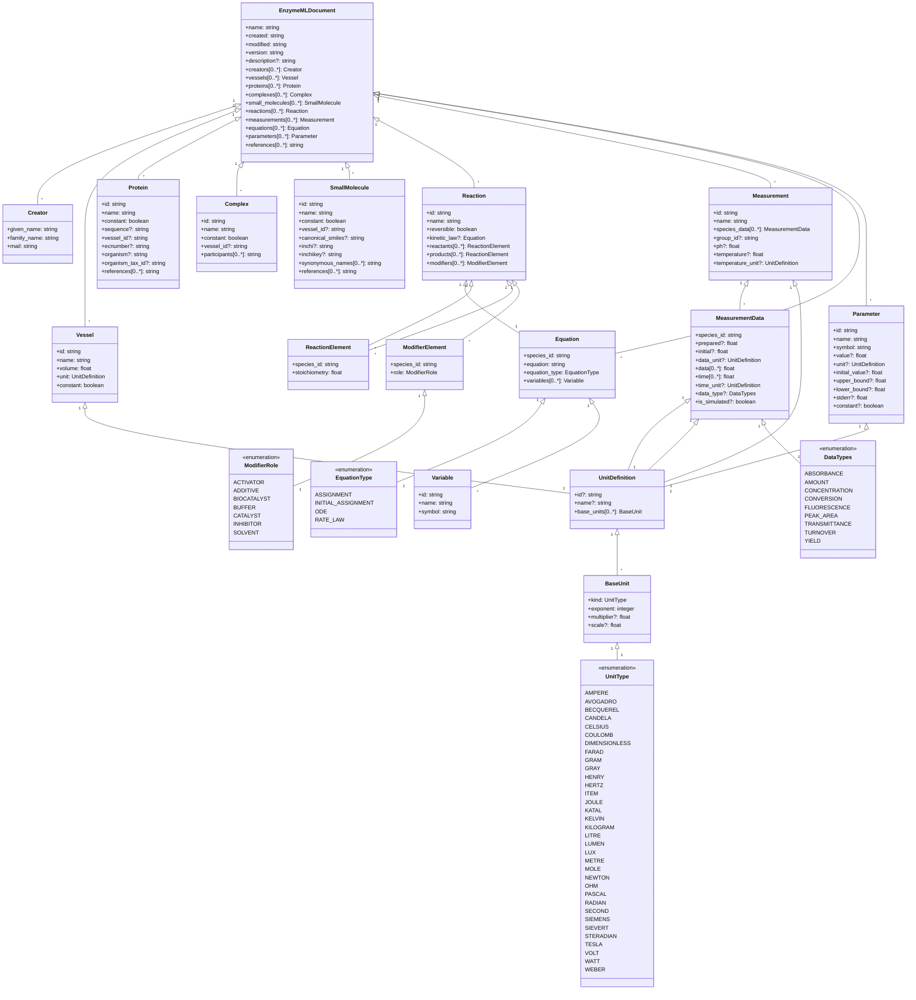

```mermaid
classDiagram
    %% Class definitions with attributes
    class EnzymeMLDocument {
        +name: string
        +created: string
        +modified: string
        +version: string
        +description?: string
        +creators[0..*]: Creator
        +vessels[0..*]: Vessel
        +proteins[0..*]: Protein
        +complexes[0..*]: Complex
        +small_molecules[0..*]: SmallMolecule
        +reactions[0..*]: Reaction
        +measurements[0..*]: Measurement
        +equations[0..*]: Equation
        +parameters[0..*]: Parameter
        +references[0..*]: string
    }

    class Creator {
        +given_name: string
        +family_name: string
        +mail: string
    }

    class Vessel {
        +id: string
        +name: string
        +volume: float
        +unit: UnitDefinition
        +constant: boolean
    }

    class Protein {
        +id: string
        +name: string
        +constant: boolean
        +sequence?: string
        +vessel_id?: string
        +ecnumber?: string
        +organism?: string
        +organism_tax_id?: string
        +references[0..*]: string
    }

    class Complex {
        +id: string
        +name: string
        +constant: boolean
        +vessel_id?: string
        +participants[0..*]: string
    }

    class SmallMolecule {
        +id: string
        +name: string
        +constant: boolean
        +vessel_id?: string
        +canonical_smiles?: string
        +inchi?: string
        +inchikey?: string
        +synonymous_names[0..*]: string
        +references[0..*]: string
    }

    class Reaction {
        +id: string
        +name: string
        +reversible: boolean
        +kinetic_law?: Equation
        +reactants[0..*]: ReactionElement
        +products[0..*]: ReactionElement
        +modifiers[0..*]: ModifierElement
    }

    class ReactionElement {
        +species_id: string
        +stoichiometry: float
    }

    class ModifierElement {
        +species_id: string
        +role: ModifierRole
    }

    class Equation {
        +species_id: string
        +equation: string
        +equation_type: EquationType
        +variables[0..*]: Variable
    }

    class Variable {
        +id: string
        +name: string
        +symbol: string
    }

    class Parameter {
        +id: string
        +name: string
        +symbol: string
        +value?: float
        +unit?: UnitDefinition
        +initial_value?: float
        +upper_bound?: float
        +lower_bound?: float
        +stderr?: float
        +constant?: boolean
    }

    class Measurement {
        +id: string
        +name: string
        +species_data[0..*]: MeasurementData
        +group_id?: string
        +ph?: float
        +temperature?: float
        +temperature_unit?: UnitDefinition
    }

    class MeasurementData {
        +species_id: string
        +prepared?: float
        +initial?: float
        +data_unit?: UnitDefinition
        +data[0..*]: float
        +time[0..*]: float
        +time_unit?: UnitDefinition
        +data_type?: DataTypes
        +is_simulated?: boolean
    }

    class UnitDefinition {
        +id?: string
        +name?: string
        +base_units[0..*]: BaseUnit
    }

    class BaseUnit {
        +kind: UnitType
        +exponent: integer
        +multiplier?: float
        +scale?: float
    }

    %% Enum definitions
    class ModifierRole {
        <<enumeration>>
        ACTIVATOR
        ADDITIVE
        BIOCATALYST
        BUFFER
        CATALYST
        INHIBITOR
        SOLVENT
    }

    class EquationType {
        <<enumeration>>
        ASSIGNMENT
        INITIAL_ASSIGNMENT
        ODE
        RATE_LAW
    }

    class DataTypes {
        <<enumeration>>
        ABSORBANCE
        AMOUNT
        CONCENTRATION
        CONVERSION
        FLUORESCENCE
        PEAK_AREA
        TRANSMITTANCE
        TURNOVER
        YIELD
    }

    class UnitType {
        <<enumeration>>
        AMPERE
        AVOGADRO
        BECQUEREL
        CANDELA
        CELSIUS
        COULOMB
        DIMENSIONLESS
        FARAD
        GRAM
        GRAY
        HENRY
        HERTZ
        ITEM
        JOULE
        KATAL
        KELVIN
        KILOGRAM
        LITRE
        LUMEN
        LUX
        METRE
        MOLE
        NEWTON
        OHM
        PASCAL
        RADIAN
        SECOND
        SIEMENS
        SIEVERT
        STERADIAN
        TESLA
        VOLT
        WATT
        WEBER
    }

    %% Relationships
    EnzymeMLDocument "1" <|-- "*" Creator
    EnzymeMLDocument "1" <|-- "*" Vessel
    EnzymeMLDocument "1" <|-- "*" Protein
    EnzymeMLDocument "1" <|-- "*" Complex
    EnzymeMLDocument "1" <|-- "*" SmallMolecule
    EnzymeMLDocument "1" <|-- "*" Reaction
    EnzymeMLDocument "1" <|-- "*" Measurement
    EnzymeMLDocument "1" <|-- "*" Equation
    EnzymeMLDocument "1" <|-- "*" Parameter
    Vessel "1" <|-- "1" UnitDefinition
    Reaction "1" <|-- "1" Equation
    Reaction "1" <|-- "*" ReactionElement
    Reaction "1" <|-- "*" ReactionElement
    Reaction "1" <|-- "*" ModifierElement
    ModifierElement "1" <|-- "1" ModifierRole
    Equation "1" <|-- "1" EquationType
    Equation "1" <|-- "*" Variable
    Parameter "1" <|-- "1" UnitDefinition
    Measurement "1" <|-- "*" MeasurementData
    Measurement "1" <|-- "1" UnitDefinition
    MeasurementData "1" <|-- "1" UnitDefinition
    MeasurementData "1" <|-- "1" UnitDefinition
    MeasurementData "1" <|-- "1" DataTypes
    UnitDefinition "1" <|-- "*" BaseUnit
    BaseUnit "1" <|-- "1" UnitType
```