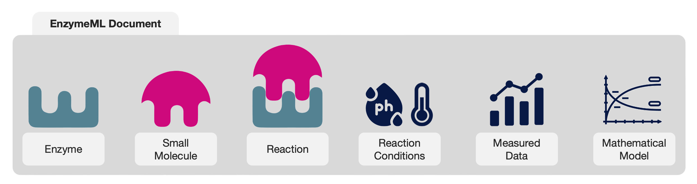

{ width="10%" }

## What is EnzymeML?

EnzymeML is a standardized data format for catalytic reaction data, designed to ensure consistency and interoperability. It enables researchers to store, share, and enrich reaction data with detailed metadata in JSON or XML formats. Tools for reading and writing EnzymeML simplify data handling and ensure reproducibility, paving the way for data-driven research in biocatalysis.

## Why EnzymeML?

🧩 **Standardization**  
  An EnzymeML Document is a standardized data format. It allows representing all data of a biocatalytic reaction in a consistent structure, independent of the experimental setup.

🔄 **Data Exchange**  
  EnzymeML facilitates the sharing of enzyme-catalyzed reaction data across scientists, tools, and databases, enabling collaborative research and integration of diverse datasets.

⚡ **Efficiency**  
  Standardization of data formats enables automation of data processing, minimizing manual steps, reducing errors, and saving time.

🌟 **FAIR Data**  
  EnzymeML makes data interoperable, constituting an important building block for making data FAIR.

🤖 **No data - no AI-party**  
  Structured data is the foundation for making your data compatible with machine learning.

## What comprises an EnzymeML Document?

An EnzymeML Document organizes and contextualizes data of a biocatalytic reaction. It integrates information about enzymes, substrates, products, experimental conditions, and measurement data, providing a structured representation that links these elements seamlessly. No matter what reaction is assayed, the data is always in the same consistent structure, enabling efficient data analysis, visualization, and sharing.

## How to use EnzymeML?

Several tools are available to read and write EnzymeML Documents, ranging from graphical desktop applications to Python libraries, specifically tailored to streamline the processing of data from different analytical instruments:

🔬 **Photometric Data**:  
  The [MTPHandler](https://github.com/fairchemistry/MTPHandler) Python library streamlines the processing of photometric data from plate readers. It enables reading, processing, and exporting data from a variety of plate reader formats, blank correction, and concentration calculation in a scalable way.

🌈 **Chromatographic Data**:  
  The [Chromatopy](https://github.com/fairchemistry/Chromatopy) Python library streamlines the processing of chromatographic time-course data. It enables reading, processing, and exporting data from a variety of chromatographic instruments, assignment of retention times to molecules, and concentration calculation in a scalable way.

🧲 **NMR Data**:  
  The [NMRPy](https://github.com/fairchemistry/NMRPy) Python library streamlines the processing of NMR time-course data.

📔 **EnzymeML Suite**:  
  The [EnzymeML Suite](https://github.com/fairchemistry/EnzymeML-Suite) is a desktop application for creating, editing, and visualizing EnzymeML Documents.

🛠️ **EnzymeML API**:  
  The [pyenzyme](https://pyenzyme.readthedocs.io/en/latest/index.html#) Python library enables reading and writing EnzymeML Documents programmatically.

## Use Cases

To get an impression of the tools, have a look at the following [use cases](use_cases.md).

- 🔬 **[MTPHandler](https://github.com/fairchemistry/MTPHandler)**
- 🌈 **[Chromatopy](https://github.com/fairchemistry/Chromatopy)**
- 🧲 **[NMRPy](https://github.com/fairchemistry/NMRPy)**
- 🛠️ **[pyenzyme](https://pyenzyme.readthedocs.io/en/latest/index.html#)**

## Cite EnzymeML

If you use EnzymeML in your work, please cite the following paper:

