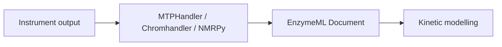

import Chat from '../../../components/Chat.astro';
import transcript from '../../../transcripts/demo.yaml?raw';

This page exercises every building block available for Learn content.

## Chat transcript

<Chat transcript={transcript} title="Asking an assistant about kinetics" />

## Mermaid



## Math

The Michaelis–Menten rate law is $v = \frac{V_{max}[S]}{K_m + [S]}$, or as a display equation:

$$
\frac{d[S]}{dt} = -\frac{k_{cat}\,[E]_0\,[S]}{K_m + [S]}
$$

## Code with a file title

```python title="read_document.py"
import pyenzyme as pe

doc = pe.read_enzymeml("experiment.json")
for measurement in doc.measurements:
    print(measurement.id, len(measurement.species_data))
```
