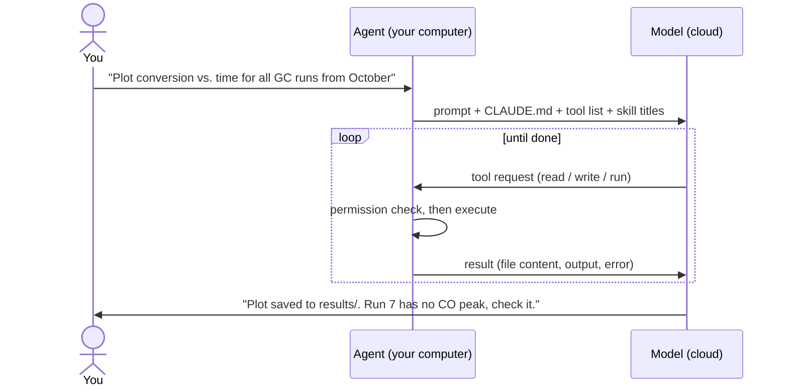
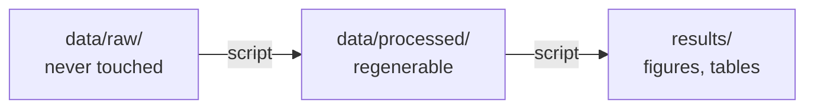

:::note[Draft outline]
:::

## Three players

| Player | Where it runs | What it does | Analogy |
|---|---|---|---|
| You | at your desk | decide, approve, judge the science | the PI |
| The model (Claude) | in the cloud | thinks and plans, cannot touch your computer | a smart colleague on the phone |
| The agent (Claude Code) | on your computer | carries out the model's requests with tools, asks before risky steps | hands at your bench |

- Key point: the model never touches your computer directly
- Every action goes through the agent, its rules, and your permission

## The loop

- Example round: run the inspect script → write `scripts/02_conversion.py` → run it → error "column Area missing" → fix → run again → plot saved
- The difference from a chatbot: the agent checks its own work by running it

## Tools: the agent's hands
- Read files
- Write / edit files
- Run commands (this is how Python gets executed)
- Search files
- Connectors (MCP): reach outside your computer, e.g. literature, DaRUS, the lab notebook
- Permissions: some tools always ask; some are blocked (e.g. editing `data/raw/`)

## Context: what the model knows
- `CLAUDE.md`: house rules, read at every session start (the lab rules on the door)
- Skills: the SOP binder; only titles are always visible, the full SOP is loaded when needed
  - e.g. "read our GC export format", "plot in the group style"
- Your prompt
- Everything the agent has read in this session

## The golden rule: data only goes through Python

- The model never changes numbers itself; it writes code that does
  - Language models can mistype or round numbers; Python cannot
- Excel: the formula sits next to the data, and a paste over it is invisible
- Here: the "formulas" live in scripts, separate from the data, readable, re-runnable
- Reproducibility test: delete `processed/` and `results/`, re-run, everything comes back
- The instrument export is evidence: it stays exactly as the instrument wrote it

## What leaves your computer
- Sent to the cloud: your prompt, `CLAUDE.md`, whatever the agent reads or prints
- Not sent: your whole disk
- But: if the agent opens a raw file, its contents are sent

## Where you are still needed
- Wrong units
- Misread columns
- Silently dropped rows
- Implausible values (selectivity > 100 %)
- → you read the summary and look at the plots

## Open questions
- Draw the loop and data flow as designed figures (instead of Mermaid)?
- Animate the loop step by step?
