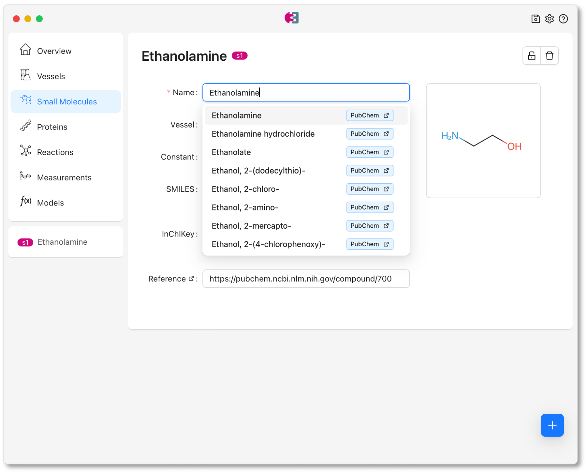

# How to use EnzymeML?

Depending on the use case, EnzymeML provides a range of tools for reading and writing EnzymeML documents. These include [native programming APIs](#native-apis) in various languages, tools for [importing data from analytical device outputs](#python-tools), and high-level [desktop applications](#enzymeml-suite) for managing EnzymeML documents.

## EnzymeML Suite

The EnzymeML Suite is a desktop application for creating, editing, and visualizing EnzymeML Documents. Via the sidebar, different elements of an EnzymeML Document can be added and edited.
{ width="75%" }  
The EnzymeML Suite is available for Windows, macOS, and Linux and can be downloaded from [here](https://github.com/EnzymeML/enzymeml-suite/releases/tag/v0.0.1).

## Python tools

Besides the native APIs, Python tools are available for directly reading and processing data from various analytical instruments. These tools share the ability to import measured data and supplement information on reaction conditions and initial concentrations in a streamlined manner. Finally, an EnzymeML document is generated, containing concentration data and details on the initial conditions of all catalysts, substrates, and products of a reaction.

### Photometric Data

The [MTPHandler](https://fairchemistry.github.io/MTPHandler/) Python library streamlines the processing of photometric data from plate readers. It enables reading, processing, and exporting data from a variety of plate reader formats, blank correction, and concentration calculation in a scalable way.

### Chromatographic Data

The [Chromatopy](https://fairchemistry.github.io/chromatopy/) Python library streamlines the processing of chromatographic time-course data. It enables reading, processing, and exporting data from a variety of chromatographic instruments, assignment of retention times to molecules, and concentration calculation in a scalable way.

### NMR Data

The [NMRPy](https://nmrpy.readthedocs.io/en/latest/) Python library streamlines the processing of NMR time-course data.

## Native APIs

EnzymeML provides native APIs in [Python](https://github.com/EnzymeML/PyEnzyme/tree/v2-migration), [Julia](https://github.com/EnzymeML/enzymeml-specifications/tree/main/enzymeml-jl), [TypeScript](https://github.com/EnzymeML/enzymeml-specifications/tree/main/enzymeml-ts), [Rust](https://github.com/EnzymeML/enzymeml-rs), and [Go](https://github.com/EnzymeML/enzymeml-specifications/tree/main/enzymeml-go). These APIs allow to read and write EnzymeML Documents programmatically in different programming languages.

## FAQ

??? question "Is EnzymeML a database?"
    No. EnzymeML is an exchange format. But the EnzymeML Data Model can be used as a blueprint to setup a local data base. 

??? question "How to define a solvent or buffer"
    A solvent or buffer in a reaction can be defined in two ways. Either it is treated as a single `SmallMolecule` from a simplified perspective, or all `SmallMolecule` components of the buffer are defined separately and grouped together as a `Complex`.

??? question "How is data from endpoint measurements handled?"
    Endpoint measurement data is handled in the same way as time-course data. Within an EnzymeML document, endpoint data is treated like time-course data with a single measurement point.  
    For example, if the concentration of a substrate species with an initial concentration of 200 µM was measured after 30 minutes and 120 µM remained, the `MeasurementData` object should be defined as follows:  
    `initial: 200`  
    `time: [0, 30]`  
    `data: [200, 120]`  

??? question "How to reference a `SmallMolecule` or `Protein` from ?"
    Both, a `SmallMolecule` and `Protein` share the fields *id* and *reference*. The *id* serves as an internal identifier, which allows to reference a `SmallMolecule` or `Protein` in `MeasurementData`, within a `Complex`, or within an `Equation` via the *species_id* field.  
    For example if a substrate `SmallMolecule` is defined with the id *s1*, it can be referenced in an `Equation`:  
    `species_id: s1`  
    `equation: v_max * s1 / (km + s1)`

    Besides the *id* field, a `SmallMolecule` and `Protein` possess a *reference* field.
    Its purpose is to reference an database entry in which a `Protein` or `SmallMolecule` is defined. This could be an url to an UniProt or ChEBI entry
